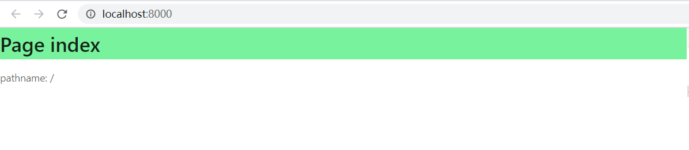
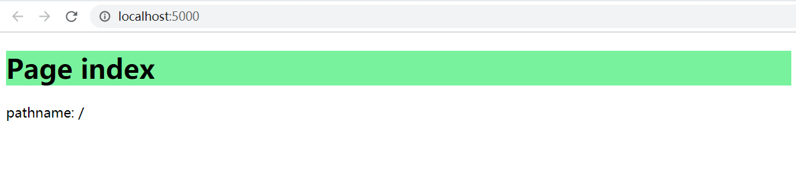

# umi3-demo

<!--
感谢您向我们反馈问题，为了高效的解决问题，我们期望你能提供以下信息：
-->

## What happens?

<!-- 清晰的描述下遇到的问题。-->

**问题**：项目中使用了 Umi3，尝试从 `umi` 中引入 `useLocation` 并在组件中使用后，发现，在开发环境中，会自动引入 `webpack:///./node_modules/antd/es/style/index.less`，同一代码在生产环境中，是不会引入的，存在样式差异。

- 开发环境：

- 生产环境：


**困惑**：不确定这是 feature 还是 bug，或者是本人使用方式不对，求解惑，很喜欢 Umi，非常感谢。

## 最小可复现仓库

> 请使用 `yarn create @umijs/umi-app` 创建，并上传到你的 GitHub 仓库

<!-- 为节约大家的时间，无复现步骤的 ISSUE 会被关闭，提供之后再 REOPEN -->
<!-- https://github.com/YOUR_REPOSITORY_URL -->
https://github.com/JophielZX/umi3-demo

## 复现步骤，错误日志以及相关配置

<!-- 请提供复现步骤，错误日志以及相关配置 -->
<!-- 可以尝试不要锁版本，重新安装依赖试试先 -->

1. 使用 `yarn create @umijs/umi-app` 初始化项目
2. 修改 `src/pages/index.tsx` 文件，如下：

    ```js
    import React from 'react';
    import { useLocation } from 'umi';
    import styles from './index.less';

    export default () => {
      const { pathname } = useLocation();

      return (
        <div>
          <h1 className={styles.title}>Page index</h1>
          <div>pathname: {pathname}</div>
        </div>
      );
    };
    ```

3. 执行 `yarn start` 查看开发环境样式
4. 执行 `yarn build`，而后 `serve dist`，查看生产环境样式

## 相关环境信息

- **Yarn 版本**：1.22.4
- **Umi 版本**：3.0.11
- **Node 版本**：v12.16.1
- **操作系统**：Win10
